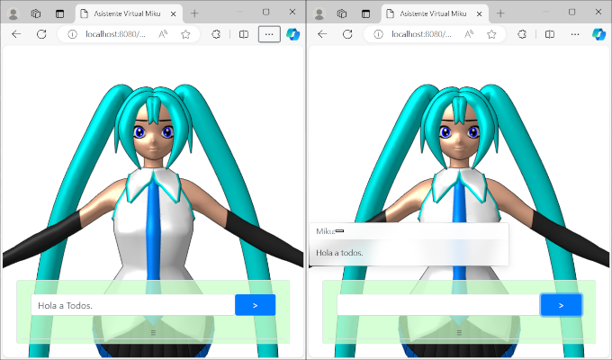

# XPD Asistente
Esta aplicación muestra en pantalla dos avatares de apariencia customizable.
## Ambiente
- Python para PC o servidor
- QPython para Android (incluye interface con __qpy__ para habilitar __Text 2 Speech__)
## Pantallas.
### Avatar Miku. 

- Es direccionado desde el root de la app. 
- Es una ensayo basado en el demo [loader / mmd / pose](https://threejs.org/examples/#webgl_loader_mmd_pose) de la librer&iacute;a [Three.JS](https://threejs.org/). 
- Este ensayo ha sustituido la GUI basada en el addon de Three.JS por una GUI basada en Bootstrap 5. 
- La aparienciencia del Avatar es cargada desde modelos MMD (archivo .pmd para el avatar y archivos .vpd para las poses).
- Incluye interface a Pseudo Chatbot basado en Eliza.
- Soporta:
  - 10 Poses.
  - Más de 70 Variaciones Faciales.
### Avatar "La Otra Miku": Avatar Personalizable

- La aparienciencia del Avatar es cargada desde modelos FBX, tanto para el avatar, como para las poses.
- Controles basados en bootstrap 5.
- Incluye interface a Pseudo Chatbot basado en Eliza.
- Soporta: 
  - 10 Poses.
  - Más de 70 Variaciones Faciales.
  - Más de 20 "Accesorios" entre Peinados y Atuendos
## Controles de Avatar.
### Interface ChatBot

Por defecto, el Chatbot se encuentra en modo "Loro", es decir, repite lo que el usuario escribe en la barra de texto cuando se presiona el botón ">".
Para habilitar el Modo Conversaci&oacute;n (Pseudo Eliza), puede plegar las acciones presionando el botón &equiv; y habilitando la opción "Modo Conversaci&oacute;n".

> [!NOTE]
> Cuando es ejecutado desde QPython, se habilita un endpoint que es invocado desde la p&aacute;gina para usar el mecanismo __Text to Speech__ nativo de Android. Esta caracer&iacute;stica puede ser desabilitada en QPython con la opci&oacute;n "Habilitar Locuci&oacute;n"