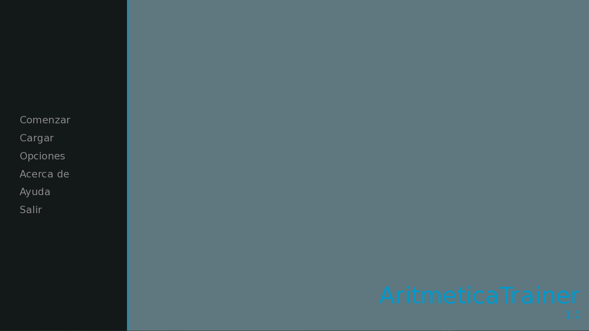

# Aritmetica Trainer

Programa para repasar C&aacute;lculo Mental desarrollado en [RenPy](https://renpy.org).

## Flujo

> La operación planteada puede ser suma, resta o multiplicaci&oacute;. El operando es elegido rand&oacute;micamente entre 1 y 9.

